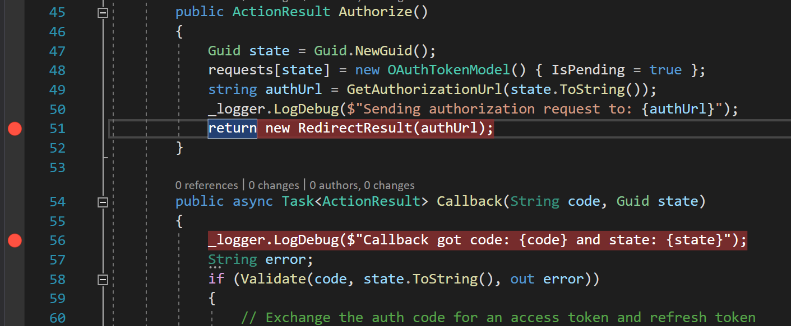
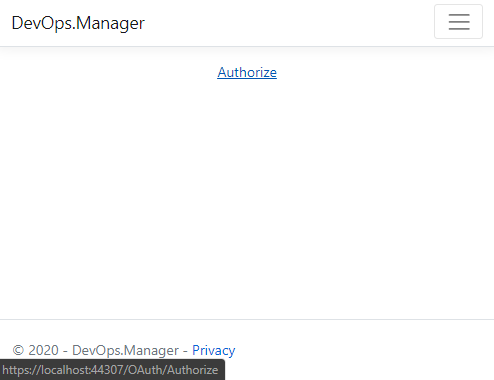
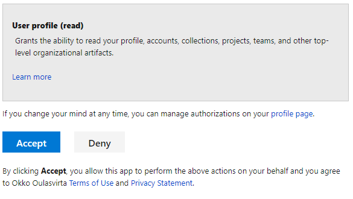
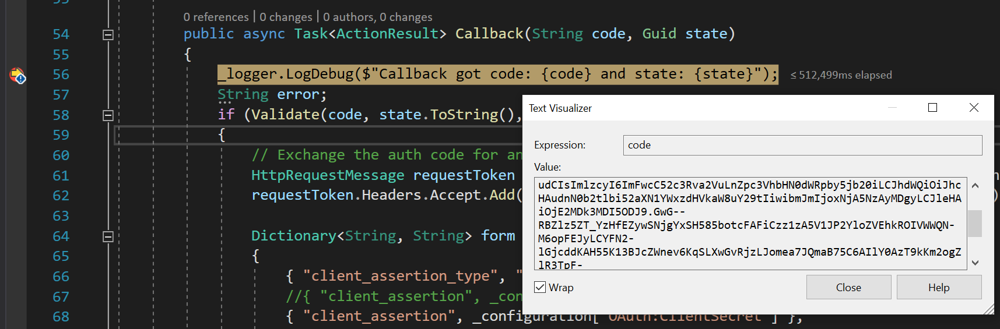
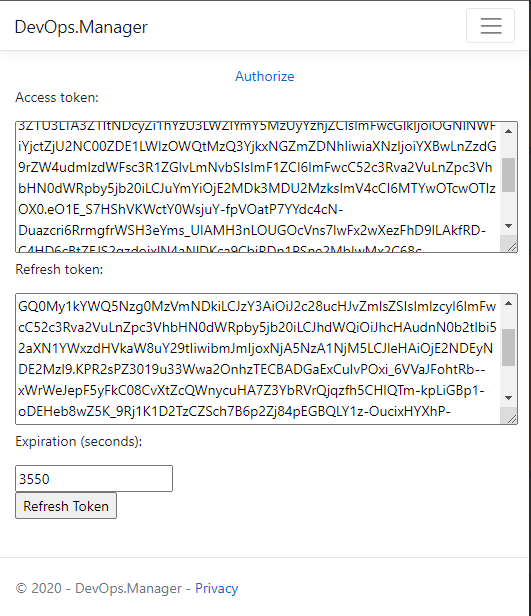

## Introduction to Azure DevOps REST authorization

_40 minutes_

This learning unit contains walkthrough of steps to create an application that gets Azure DevOps user's grant to access user's profile details using Azure DevOps REST API. OAuth protocol is used so that username and password is not needed.

After this units steps we have an app that can be run locally (`https://localhost`) and we will get access token to call Azure DevOps REST API on behalf of user. However, the REST API calls will be done in next learning unit.

> 💡 TIP: Azure DevOps Services uses the [OAuth 2.0 protocol](https://oauth.net/2/) to authorize registered app for a user and generate an **access token** and **refresh token**.

### Learning objectives

After completing steps in this module, you will be able to:

- Create a dotnet core MVC app.
- Register an app as Azure DevOps authorized application.
- Understand basics of dotnet core app settings configuration for local development.
- Debug Azure DevOps authorization and access token flow.

### Prerequisites

- Basic knowledge of Azure DevOps.
- Basic knowledge about OAuth.
- [.NET Core SDK](https://dotnet.microsoft.com/download/dotnet/5.0) installed.
- [VS code](https://code.visualstudio.com/download) installed.
- Existing GitHub account and empty repository created and cloned locally.

### OAuth flow to request Auzure DevOps REST API

OAuth authorization sequence is following:

- **Request auhtorization for user**: Using App ID you got from `VisualStudio.com` (old address) or `aex.dev.azure.com` registration, you can send users to Azure DevOps Services, and ask them to authorize your app to access their organizations with predefined _Authorized scope(s)_.
- **Send authorization**: When user grants authorization for your app, `aex.dev.azure.com` will send short lived authorization code as query string parameter to your app's _Authorization callback URL_.
- **Get Access token**: Authorization code and your app's _client secret_ is then used to get an _access token_ for that user.
- **CALL REST API with access token**:  When you call Azure DevOps REST APIs for that user, use that user's access token. Access tokens do expire. Refresh token is used to get new access token if it's expired.

  

### Create a .NET Core app

Use .NET command-line interface (CLI) create new Model-View-Controller app by executing following command in the root of your repository.

```powershell
dotnet new mvc -n DevOps.Manager -o src
```

This will create a simple csharp project `DevOps.Manager.csproj` with MVC file structure into `src` folder. In later steps you will be adding Model and Controller to handle OAuth authorization flow. But for now, we need for the next step port number what your app is listening when running the app locally. Open `src\Properties\launchSettings.json` file, review and copy the `sslPort` setting value.

```json
{
  "iisSettings": {
    "windowsAuthentication": false,
    "anonymousAuthentication": true,
    "iisExpress": {
      "applicationUrl": "http://localhost:38538",
      "sslPort": 44307
    }
  }
}
```

> 💡 TIP: The .NET CLI is included with the [.NET SDK](https://docs.microsoft.com/dotnet/core/sdk). To learn how to install the .NET SDK, see [Install .NET Core](https://docs.microsoft.com/dotnet/core/install/windows).

### Register app to Azure DevOps

To debug locally `aex.dev.azure.com` OAuth flow, register your app with _Callback URL_ that uses your dotnet core app's local iisExpress address as baseurl `https://localhost:44307` (verify your sslPort setting).

> 💡 TIP: Azure DevOps applications can be registered at: [https://aex.dev.azure.com/app/register](https://aex.dev.azure.com/app/register).

Application registration has three sections:

- **Company information**: these details are shown to user when they are prompted to grant OAuth authorization request.
- **Application information**: for now use localhost based values.
  - _Website URL_: `https://localhost:44307/`
  - _Callback URL_: `https://localhost:44307/oauth/callback`
- **Authorized scopes**: to access user's details check _User profile (read)_ selection, that maps to `vso.profile` REST API scope. This will grants the app to read user's profile, accounts, collections, projects, teams, and other top-level organizational details.

> ☝ NOTE: Authorized [scopes](https://docs.microsoft.com/azure/devops/integrate/get-started/authentication/oauth?#scopes) selection cannot be changed afterwards. You need to delete and re-create the application registration to change scope selection. This will generate new App ID and Client secrets and requires your user's to reauthorize the app.

After registration web app's **Application Settings** are shown. These details are used to authorize the web app to access, in this case, user's profile details on behalf of user.

Review and copy your app's **Application Settings**:

- **Authorize URL** is called with **App ID** and **Authorized Scopes** (vso.profile) to ask user's consent for authorize the web app to access their user profile details.
- **Access Token URL** is called with **Client Secret** when web app needs to get an _access token_ to call an Azure DevOps REST API or when the access token needs to be refreshed with _refresh token_.

> 💡 TIP: Application registration's _Application Settings_ can be accessed and edited in Azure DevOps profile page: [https://aex.dev.azure.com/me](https://aex.dev.azure.com/me) in _Applications and services_ section.

### Add OAuth settings to .NET core app

Open `src\appsettings.json` and append following OAuth section into it.

```json
{
  "OAuth": {
    "AppID": "?",
    "ClientSecret": "?",
    "AuthorizedScopes": "vso.profile",
    "AuthorizeUrl": "https://app.vssps.visualstudio.com/oauth2/authorize",
    "RequestTokenUrl": "https://app.vssps.visualstudio.com/oauth2/token",
    "ApplicationCallbackUrl": "?",
  }
}
```

For now this is ok... you will replace `?` values with _production_ values in the next learning unit. However, now we override our remaining values in _development_ settings, that are used when we debug our application just locally.

Open `src\appsettings.Development.json` and override following settings.

```json
{
  "OAuth": {
    "AppID": "YOUR APP ID GUID HERE",
    "ClientSecret": "YOUR CLIENT SECRET HERE",
    "ApplicationCallbackUrl": "https://localhost:44307/OAuth/callback",
  }
}
```

Open `.gitignore` file in the root of the repository and add following line to it:

```bash
# Don't commit development appsettings
/src/appsettings.Development.json
```

This will ensure that your development time secret(s) will not be mistakenly committed into repository.

> ☝ NOTE: Secrets such as this ClientSecret should be in Azure Key Vault.

Ensure that appsettings are loaded and ready to be injected to controllers. Modify _ConfigureServices_ method at `src\Startup.cs` and IConfiguration as singleton service.

```csharp
public void ConfigureServices(IServiceCollection services)
{
  services.AddSingleton<IConfiguration>(Configuration);
  services.AddControllersWithViews();
}
```

This will load appsettings.json and appsettings.Development.json contents to be loaded and available for use.

### Add Model for OAuth token

Create a new file for OAuth token model `src\Models\OAuthTokenModel.cs` and add following contents:

```csharp
using System;
using System.Runtime.Serialization;

namespace DevOps.Manager.Models
{
  [DataContract]
  public class OAuthTokenModel
  {
    [DataMember(Name = "access_token")]
    public String AccessToken { get; set; }

    [DataMember(Name = "token_type")]
    public String TokenType { get; set; }

    [DataMember(Name = "refresh_token")]
    public String RefreshToken { get; set; }

    [DataMember(Name = "expires_in")]
    public int ExpiresIn { get; set; }

    public bool IsPending { get; set; }
  }
}
```

DataMember names are the same keys that we can find from the payload sent by the Auhtorization flow when the user's consent is redirected to our app's callback method.

### Add OAuth controller to .NET core app

We defined in the Azure DevOps application registration that our user authorization logic is handled in the contoller with _Callback URL_ of `https://localhost:44307/OAuth/callback`. Create a new file `src\Controllers\OAuthController.cs` and inject appsettings configuration in it constructor.

```csharp
using Microsoft.AspNetCore.Mvc;
using Microsoft.Extensions.Configuration;
using Microsoft.Extensions.Logging;
using Newtonsoft.Json;
using Newtonsoft.Json.Linq;
using System;
using System.Collections.Generic;
using System.Net.Http;
using System.Net.Http.Headers;
using System.Threading.Tasks;
using System.Web;

namespace DevOps.Manager.Controllers
{
  public class OAuthController : Controller
  {
    private static readonly HttpClient client = new HttpClient();
    private static readonly Dictionary<Guid, OAuthTokenModel> requests = new Dictionary<Guid, OAuthTokenModel>();
    private readonly IConfiguration _configuration;
    private readonly ILogger<OAuthController> _logger;

    public OAuthController(ILogger<OAuthController> logger, IConfiguration configuration)
    {
      _logger = logger;
      _configuration = configuration;
    }
  }
}
```

Add helper method to generate url to send user for granting authorization of the app.

```csharp
private String GetAuthorizationUrl(String state)
{
  UriBuilder uriBuilder = new UriBuilder(_configuration["OAuth:AuthorizeUrl"]);
  var queryParams = HttpUtility.ParseQueryString(uriBuilder.Query ?? String.Empty);

  queryParams["client_id"] = _configuration["OAuth:AppID"];
  queryParams["response_type"] = "Assertion";
  queryParams["state"] = state;
  queryParams["scope"] = _configuration["OAuth:AuthorizedScopes"];
  queryParams["redirect_uri"] = _configuration["OAuth:ApplicationCallbackUrl"];

  uriBuilder.Query = queryParams.ToString();

  return uriBuilder.ToString();
}
```

Add `Authorize` method which is called when we want to send user to login + grant authorization to our app in Azure DevOps.

```csharp
public ActionResult Authorize()
{
  Guid state = Guid.NewGuid();
  // Keep track of the request states
  requests[state] = new OAuthTokenModel() { IsPending = true };
  string authUrl = GetAuthorizationUrl(state.ToString());
  _logger.LogDebug($"Sending authorization request to: {authUrl}");
  return new RedirectResult(authUrl);
}
```

Add helper method `Validate` to check that our authorization code and state or request are as expected.

```csharp
private static bool Validate(String code, String state, out String error)
{
  error = null;

  if (String.IsNullOrEmpty(code))
  {
    error = "Invalid authorization code";
  }
  else
  {
    Guid authorizationRequestKey;
    if (!Guid.TryParse(state, out authorizationRequestKey))
    {
      error = "Invalid authorization request key";
    }
    else
    {
      OAuthTokenModel token;
      if (!requests.TryGetValue(authorizationRequestKey, out token))
      {
        error = "Unknown authorization request key";
      }
      else if (!token.IsPending)
      {
        error = "Authorization request key already used";
      }
      else
      {
        requests[authorizationRequestKey].IsPending = false; 
      }
    }
}
```

Add `Callback` method to handle response from authorization request. Azure DevOps sends authorization code and state as query strings parameteters for the Callback.

```csharp
public async Task<ActionResult> Callback(String code, Guid state)
{
  _logger.LogDebug($"Callback got code: {code} and state: {state}");
  String error;
  if (Validate(code, state.ToString(), out error))
  {
    // Exchange the auth code for an access token and refresh token
    HttpRequestMessage requestToken = new HttpRequestMessage(HttpMethod.Post, _configuration["OAuth:RequestTokenUrl"]);
    requestToken.Headers.Accept.Add(new MediaTypeWithQualityHeaderValue("application/json"));

    Dictionary<String, String> form = new Dictionary<String, String>()
    {
      { "client_assertion_type", "urn:ietf:params:oauth:client-assertion-type:jwt-bearer" },
      { "client_assertion", _configuration["OAuth:ClientSecret"] },
      { "grant_type", "urn:ietf:params:oauth:grant-type:jwt-bearer" },
      { "assertion", code },
      { "redirect_uri", _configuration["OAuth:ApplicationCallbackUrl"] }
    };
    requestToken.Content = new FormUrlEncodedContent(form);

    HttpResponseMessage tokenResponse = await client.SendAsync(requestToken);

    if (tokenResponse.IsSuccessStatusCode)
    {
      String body = await tokenResponse.Content.ReadAsStringAsync();

      OAuthTokenModel tokenModel = requests[state];
      JsonConvert.PopulateObject(body, tokenModel);

      ViewBag.Token = tokenModel;
    }
    else
    {
      error = tokenResponse.ReasonPhrase;
    }
  }

  if (!String.IsNullOrEmpty(error))
  {
    ViewBag.Error = error;
  }

  ViewBag.ProfileUrl = _configuration["OAuth:ProfileUrl"];

  return View("Views/Home/Index.cshtml");
}
```

Method validates the response and then creates POST request to retrieve _access token_ using _Client Secret_ and the authorization code. If the response is success tokens are then stored to ViewBag and user is redirected to homepage.

## Debug Authorize and request Access token flow

Add break points to _OAuthController_ `Authorize` and `Callback` methods.



Add `Authorize` link to home view `src\Views\Home\Index.cshtml` and section that renders access and refresh tokens when user has granted access to user's profile details. Furthermore there is a button to `Refresh Token` which calls _OAuth_ controller _RefreshToken_ method.

```html
<div class="text-center">
  <a href="~/OAuth/Authorize">Authorize</a>
</div>

<div>
@if(null != ViewBag.Token)
{
  <script>
    var expiration = @ViewBag.Token.ExpiresIn;
    var startTime = Math.floor(Date.now() / 1000);
    var timer = window.setInterval(updateExpiration, 1000);
    function updateExpiration() {
      var val = Math.max(0, expiration - (Math.floor(Date.now() / 1000) - startTime));
      document.getElementById("expiration").value = val;
      if (val == 0) {
        window.clearInterval(timer);
      }
    }
  </script>

  <form method="post" action='@Url.Action("RefreshToken", "OAuth")'>
    <p>Access token:</p>
    <textarea rows="6" cols="80" readonly="readonly">@ViewBag.Token.AccessToken</textarea>
    <p>Refresh token:</p>
    <textarea rows="6" cols="80" name="refreshToken" readonly="readonly">@ViewBag.Token.RefreshToken</textarea>
    <p>Expiration (seconds):</p>
    <input type="text" id="expiration" value="@ViewBag.Token.ExpiresIn" readonly />
    <p><input type="submit" value="Refresh Token" /></p>
  </form>
}
</div>
```

This will render link to start `Authorize` flow and in if there is already tokens retrieved `access token` and `refresh token` are shown to user.

Hit F5 key to start debugging and click the `Authorize` link. This will call _OAuthController_ and starts authorization flow for the user.



Review `authUrl` variable value. Make notice how `state` (guid) is sent as part of query parameters. This guid will be used to validate response in `Callback` when the user grants authorization for the app.

Hit F5 key and user will be redirected to `https://app.vssps.visualstudio.com/oauth2/authorize` for authorization and prompted to accept access to user's profile details. Login to VisualStudio.com with your Azure DevOps credentials when asked.



Click `Accept` and `VisualStudio.com` redirects browser back to the application's _OAuthController_ and the breakpoint in the start of the _Callback_ method will be hit. Notice that `VisualStudio.com` sent `state` and authorization `code` as query parameters. State should match the one that was generated when authorize request was sent.



> 💡 TIP! To analyze contents of the code copy the value and decode it using [https://jwt.ms/](https://jwt.ms/) service.

Short lived (~15 minutes) authorization code is used when request for access token is sent to `VisualStudio.com`. Continue debugging - go through validatation steps and review what get sent to `VisualStudio.com` when request for access/refresh tokens are sent. After the access/refresh tokens request returns home view shows access and refresh tokens.



Review token anatomy in the [https://jwt.ms/](https://jwt.ms/) service.

## Modify OAuth controller for Referesh Token funtionality

Note that home view counts seconds when the _access token_ expires. To refresh access token we need to send request to `VisulaStudio.com` and provide _refresh token_ as proof that we are allowed to get a new access token.

Add new method _RefreshToken_ to `src\Controllers\OAuthController.cs` that generates correct payload for the request and updates access token when it arrives.

```csharp
public async Task<ActionResult> RefreshToken(string refreshToken)
{
  String error = null;
  if (!String.IsNullOrEmpty(refreshToken))
  {
    // Form the request to exchange an auth code for an access token and refresh token
    HttpRequestMessage requestMessage = new HttpRequestMessage(HttpMethod.Post, _configuration["OAuth:RequestTokenUrl"]);
    requestMessage.Headers.Accept.Add(new MediaTypeWithQualityHeaderValue("application/json"));

    Dictionary<String, String> form = new Dictionary<String, String>()
    {
        { "client_assertion_type", "urn:ietf:params:oauth:client-assertion-type:jwt-bearer" },
        { "client_assertion", _configuration["OAuth:ClientSecret"] },
        { "grant_type", "refresh_token" },
        { "assertion", refreshToken },
        { "redirect_uri", _configuration["OAuth:ApplicationCallbackUrl"] }
    };
    requestMessage.Content = new FormUrlEncodedContent(form);

    // Make the request to exchange the auth code for an access token (and refresh token)
    HttpResponseMessage responseMessage = await client.SendAsync(requestMessage);

    if (responseMessage.IsSuccessStatusCode)
    {
        // Handle successful request
        String body = await responseMessage.Content.ReadAsStringAsync();
        ViewBag.Token = JObject.Parse(body).ToObject<OAuthTokenModel>();
    }
    else
    {
        error = responseMessage.ReasonPhrase;
    }
  }
  else
  {
      error = "Invalid refresh token";
  }

  if (!String.IsNullOrEmpty(error))
  {
      ViewBag.Error = error;
  }

  return View("Views/Home/Index.cshtml");
}
```

Add breakpoint to first line of the _RefreshToken_ method and hit F5 to start debugging again. Note that we have not yet persisted access token anywhere so you need to click Authorize again. However, this time user will not be prompted anything since this user has already granted access. When the access tokens and refresh tokens are rendered, click the _Refresh Token_ button. Review how after the pafe refreshes both access and refresh tokens are updated.

> ☝ Note! Same refresh token can be used only ones to retrieve a new access token.

___
## Next unit: Call Azure DevOps REST API with OAuth access token

